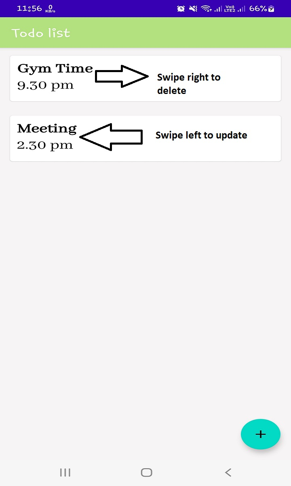

# Todo_list
An android App using Room database and MVVM architecture.

# Description
It's a todo list app where,user can add,view ,delete ,update data.
This app is for only light theme , it will not work on dark theme.

# For delete a data swipe the card right

# For update/full data view  swipe the card left

# Requirements
minSdkVersion 21
